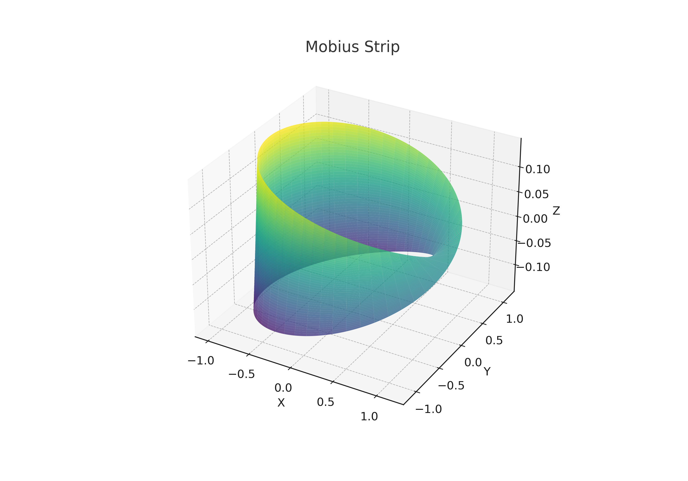

# Mobius Strip Model

A Python script to **model and visualize a Mobius strip** using parametric equations.  
It computes the **surface area** and **edge length** numerically and displays a 3D visualization.

---

## Features
- 3D parametric mesh generation of the Mobius strip
- Numerical integration for calculating surface area
- Numerical edge length approximation along the boundary
- Interactive 3D plot using matplotlib

---

## Installation

Clone this repository:

```bash
git clone https://github.com/yourusername/mobius-strip.git
cd mobius-strip
```

Install dependencies:

```bash
pip install -r requirements.txt
```

---

## Usage

Run the script directly:

```bash
python mobius_strip.py
```

The script will:
- Print the computed **surface area** and **edge length**.
- Display an interactive 3D plot.

---

## Dependencies

- `numpy`
- `matplotlib`
- `scipy`

---

## Example Output

**Surface Area and Edge Length:**
```
Surface Area: 1.8840
Edge Length: 12.5664
```

**3D Plot:**



---

## License

MIT License

---


